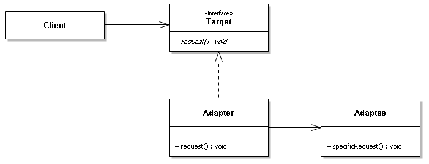
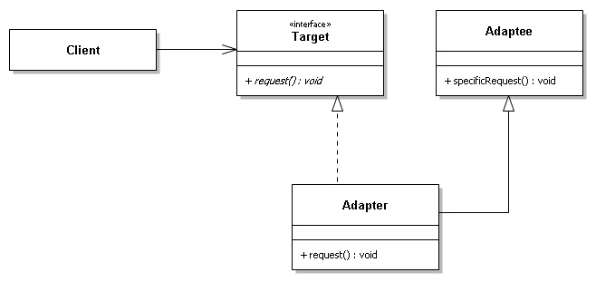

Adapter Pattern
===
Definition
-------
將一個類別的介面，轉換成另一個介面以供客戶使用。
轉接器讓原本介面不相容的類別可以合作。

Story
-------
Ifalo 是一間購物網，有自己登入的入口，供會員登入
```php
// Target
interface IfaloInterface
{
    public function getToken();
    public function login();
}

class Ifalo implements IfaloInterface {
    public function getToken() {
        return md5(uniqid(rand()));
    }

    public function login() {
        return 'Ifalo 登入成功';
    }
}
```
但購物網為了擴大經營，並且方便客人快速登入，行銷提供文件請工程師介接Facebook API
```php
interface FaceBookInterface
{
    public function getAccessToken();
    public function userLogin();
}

class Facebook implements FaceBookInterface {

    public function getAccessToken() {
        return md5(uniqid(rand()));
    }

    public function userLogin() {
        return 'FB 登入成功';
    }
}
```
問題來了，FB的API與原本Ifalo的方法不一樣，但我們又不想改到原本的程式，於是寫了一個轉接器
```php
// Adapter
class FacebookAdapter implements IfaloInterface
{
    private $facebook;

    public function __construct(FaceBook $facebook)
    {
	    // Adaptee
        $this->facebook = $facebook;
    }

    public function getToken()
    {
        return $this->facebook->getAccessToken();
    }

    public function login()
    {
        return $this->facebook->userLogin();
    }
}
```
Client 執行一下
```php
// Ifalo 登入
$Ifalo = new Ifalo();
var_dump($Ifalo->getToken());
var_dump($Ifalo->login());

// FB 登入
$FB = new Facebook();
$Adapter = new FacebookAdapter($FB);
var_dump($Adapter->getToken());
var_dump($Adapter->login());
```

UML
---
* 物件轉接器 (組合)


* 類別轉接器 (繼承)


* Target : 目標角色，客戶期待的介面
* Adaptee : 來源角色，被轉接者
* Adapter : 轉接器角色，把來源轉接成目標

應用時機
---
* 第三方API套件，想把它加到我們的系統
* 套件的方法跟現在的系統無法相容，就很適用轉接器模式

優點
-------
* 幫助包裝第三方 API 與現有的系統介面整合
* 靈活度高，可隨時刪掉轉接器，不用動到其他程式
* 擴展性很好，可以增加新的轉接器 (例: TwitterAdapter)

缺點
-------
* 用太多轉接器，會讓系統較複雜
* PHP JAVA 不支援多重繼承，所以最多只能轉接一個轉接者物件

轉接器模式與裝飾者模式
---
* 轉接器模式看起來跟裝飾者模式 Decorator 有點相似——都是以一個物件包裝另一個物件——但差別在於兩者的目的：轉接者與被轉接者通常是不同的類別，目的在轉接介面為另一個介面。而裝飾者與被裝飾者是同一個類別，目的是在原有物件上增添新的行為，而不改變介面。

Reference
---
[Adapter 轉接器模式](https://pokk.gitbooks.io/program-experience/content/zh-tw/Design%20Pattern/structural/adapter.html)

